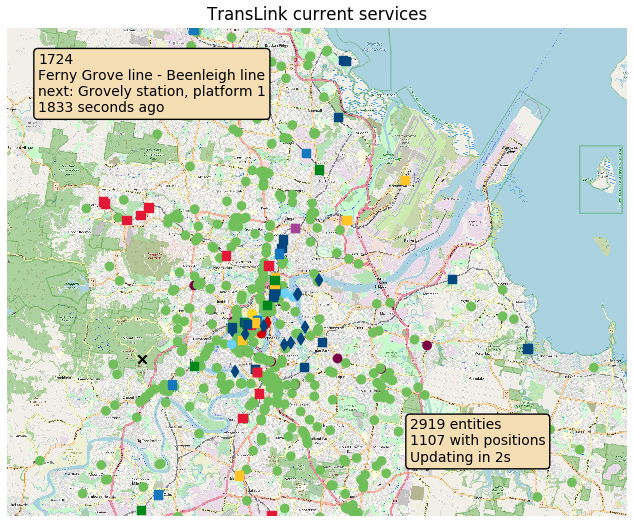

# Translink GTFS Realtime Map

## Dependencies
`pip3 install -r requirements.txt`
- matplotlib (main plotting lib)
- requests
- smopy (OSM tile downloads)
- gtfs-realtime-bindings
- protobuf3-to-dict

## Usage
1. Download GTFS static files ([TransLink](https://gtfsrt.api.translink.com.au/GTFS/SEQ_GTFS.zip)), unzip into SEQ_GTFS dir (configurable)
2. Run `python3 feedparser.py`, will download and save OSM map to `MAP_FILENAME` for region defined in `BBOX`

## Modifying for other feeds
- Download correct GTFS static files
- Edit `FEED_URL` in `feedparser.py`
- Edit `BBOX` with coord bounds `(LONG_MIN, LONG_MAX, LAT_MIN, LAT_MAX)`, useful tool: https://www.openstreetmap.org/export
- Edit `get_entity_type` function to return correct vehicle i.e. bus/train/ferry/etc from the GTFS dataset. 
  Otherwise simply replace with e.g. `return 'buses'` (all vehicles will be labelled as green dots)